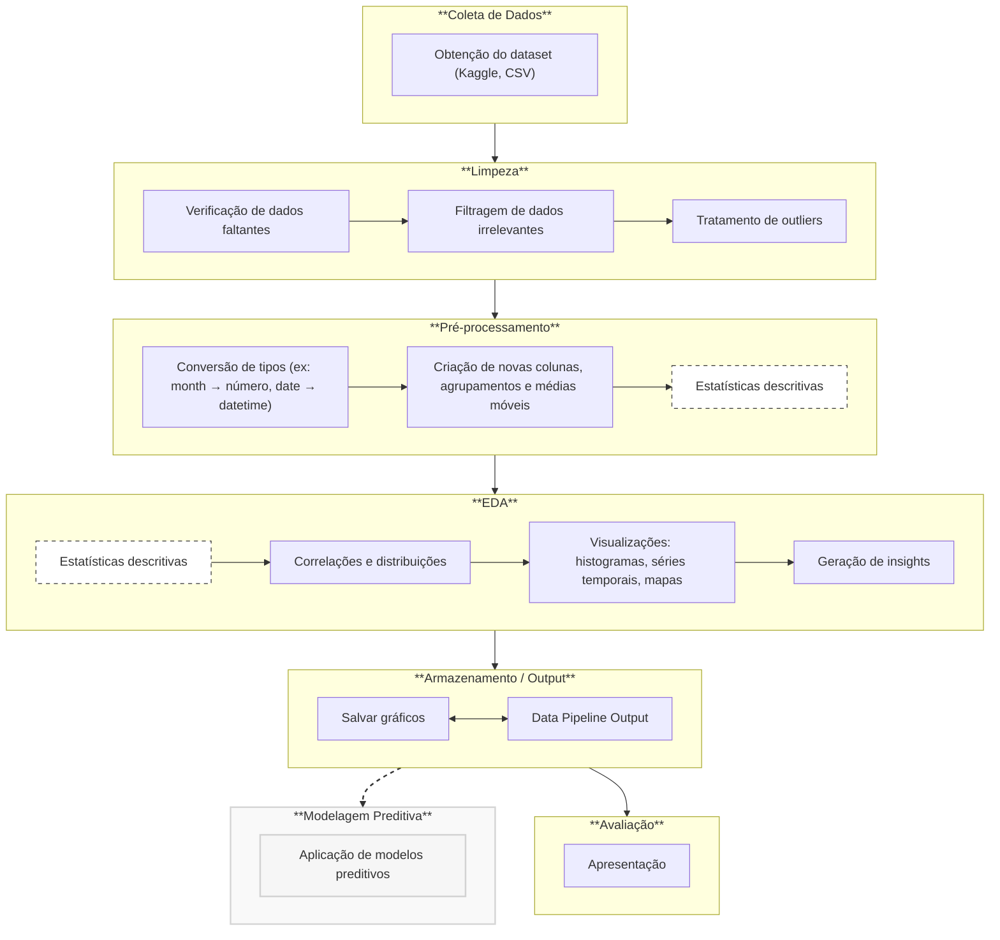

# Forest Fires in Brazil - Análise de Incêndios Florestais no Brasil

## 1. Introdução

Neste trabalho, vou apresentar a análise do dataset *Forest Fires in Brazil*, que contém informações sobre o número de incêndios florestais no Brasil entre os anos de 1998 a 2017, divididos por estado. O objetivo é entender as tendências temporais e geográficas dos incêndios florestais no Brasil, um problema crítico para a preservação das florestas tropicais, principalmente a Amazônia.

---

## 2. Contexto e Importância do Tema

**Problema dos incêndios florestais:**  
Incêndios florestais são uma grande ameaça à preservação das florestas tropicais, e a Amazônia, maior floresta tropical do planeta, está no centro dessa questão.

**Importância do estudo:**  
Compreender a frequência dos incêndios ao longo do tempo pode ajudar na implementação de ações preventivas para preservar as florestas e minimizar os impactos ambientais.

**Fonte dos dados:**  
Os dados utilizados vêm do Sistema Nacional de Informações Florestais do governo brasileiro. O dataset está disponível no Kaggle, [aqui](https://www.kaggle.com/datasets/gustavomodelli/forest-fires-in-brazil).

---

## 3. Descrição do Dataset

- **Período e Fonte**:
  - O dataset contém dados sobre os incêndios florestais no Brasil no período de 1998 a 2017.
  - Fonte: Sistema Nacional de Informações Florestais (SNIF) - [dados.gov.br](http://dados.gov.br/dataset/sistema-nacional-de-informacoes-florestais-snif)

- **Colunas principais**:
  - `year`: Ano do registro
  - `state`: Estado do Brasil
  - `month`: Mês do ano
  - `number`: Número de focos de incêndio

- **Volume de dados**:
  - O dataset possui mais de 6.000 registros abrangendo todos os estados do Brasil.

---

## 4. Análises a Serem Realizadas

- **Distribuição Temporal**:
  - Análise de como os incêndios se distribuem ao longo dos anos e meses, identificando padrões sazonais.

- **Comparação entre os Estados**:
  - Comparação dos estados brasileiros para destacar os que mais sofreram com queimadas.

- **Tendências ao Longo dos Anos**:
  - Verificação de se houve crescimento ou diminuição no número de incêndios ao longo dos anos.

- **Análise Sazonal**:
  - Identificação de quais meses do ano apresentam maior ocorrência de incêndios.

- **Visualizações Geográficas**:
  - Utilização de mapas e gráficos para identificar concentrações de focos de incêndio em regiões específicas.

---

## 5. Pipeline de Análise

Para garantir uma análise estruturada e reprodutível, foi desenvolvida a seguinte pipeline que organiza cada etapa do processo de análise de dados:


### Descrição das Etapas:
- **Coleta de Dados:** Consiste na obtenção do dataset público no formato CSV.

- **Limpeza:** Etapa dedicada à verificação de dados faltantes e tratamento de outliers que possam afetar as análises.

- **Pré-processamento:** Conversão de colunas para tipos apropriados e normalização, preparando os dados para análises quantitativas e visuais.

- **Análise Exploratória (EDA):** Inclui análise estatística, visualizações gráficas e descoberta de padrões e correlações nos dados.

- **Armazenamento/Output:** Geração e salvamento de gráficos e documentação para facilitar a replicação e entendimento do processo.

- **Modelagem (Futuro):** Possível aplicação de modelos de Machine Learning para prever focos de incêndio com base em padrões históricos.

- **Comunicação dos Resultados:** Apresentação dos insights obtidos por meio de relatórios, dashboards ou vídeos explicativos.

## 6. Conclusão

A análise dos incêndios florestais no Brasil pode fornecer insights importantes sobre o comportamento temporal e geográfico dos incêndios. Com base nessas informações, é possível propor políticas de prevenção mais eficazes para reduzir o impacto ambiental das queimadas.

---

## 7. Dependências

Este projeto foi desenvolvido em Python e depende de diversas bibliotecas voltadas para análise de dados, visualização gráfica e criação de dashboards interativos.

### Principais bibliotecas utilizadas:

| Biblioteca  | Finalidade                                           | Versão mínima recomendada |
|-------------|------------------------------------------------------|----------------------------|
| `pandas`    | Manipulação e análise de dados                       | ≥ 1.5                      |
| `seaborn`   | Visualização estatística (gráficos estáticos)        | —                          |
| `matplotlib`| Base gráfica para bibliotecas como Seaborn           | —                          |
| `plotly`    | Criação de gráficos interativos                      | ≥ 5.0                      |
| `streamlit` | Desenvolvimento do dashboard e interface web         | ≥ 1.10                     |
| `pytest`    | Testes automatizados de funções (opcional)           | —                          |

### Instalação

Para instalar todas as dependências do projeto, utilize o comando:

```bash
  pip install -r requirements.txt
```

---

## 8. Como Executar o Dashboard Interativo

O dashboard interativo deste projeto foi desenvolvido com a biblioteca **Streamlit** e utiliza **Plotly** para gráficos interativos.

### Passos para executar o app:

Certifique-se de que todas as dependências estão instaladas:

```bash
  pip install -r requirements.txt
```
---

### 9. Como Executar o Projeto

Este projeto oferece duas formas principais de execução:

#### 9.1. Executar a Análise Exploratória (EDA) com Gráficos Estáticos
Para gerar os gráficos estáticos da Análise Exploratória de Dados (EDA) e salvá-los na pasta output/plots, execute o script main.py diretamente. Certifique-se de que o ambiente Python está configurado e as dependências instaladas.

Navegue até a raiz do projeto no seu terminal:

```bash
cd seu_projeto/
```

(Substitua **seu_projeto/** pelo caminho real para a pasta raiz do seu projeto).

Execute o script **main.py**:
```bash
python run src/main.py
```
Os gráficos serão salvos na pasta output/plots (que será criada se não existir).

#### 9.2. Executar o Dashboard Interativo (Streamlit)
Para iniciar o dashboard interativo, que permite explorar os dados de forma dinâmica com gráficos do Plotly, utilize o comando streamlit run.

Navegue até a raiz do projeto no seu terminal:

```bash
cd seu_projeto/
```

Execute o aplicativo *Streamlit* **app.py**:

```bash
python -m streamlit run src/app.py
```
Este comando abrirá automaticamente uma nova aba no seu navegador web padrão com o dashboard. Se não abrir, o terminal fornecerá um link local (ex: http://localhost:8501) que você pode copiar e colar manualmente no navegador.

> Para rodar tudo faça: **./run.sh** no linux ou **./run.bat** no windows.

---

## Agradecimentos

Agradeço a atenção de todos e espero que essa análise ajude a compreender melhor a dinâmica dos incêndios florestais no Brasil.

---

## Links Úteis

- **Dataset completo**: [Forest Fires in Brazil - Kaggle](https://www.kaggle.com/datasets/gustavomodelli/forest-fires-in-brazil)
- **Fonte dos dados**: [Sistema Nacional de Informações Florestais (SNIF)](http://dados.gov.br/dataset/sistema-nacional-de-informacoes-florestais-snif)
